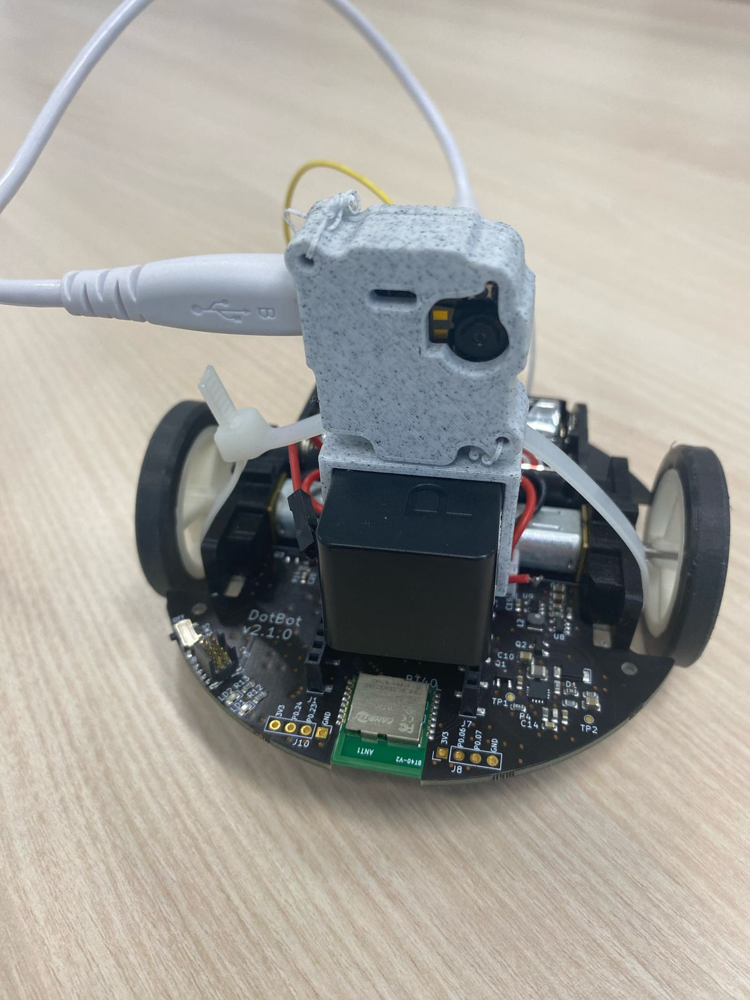
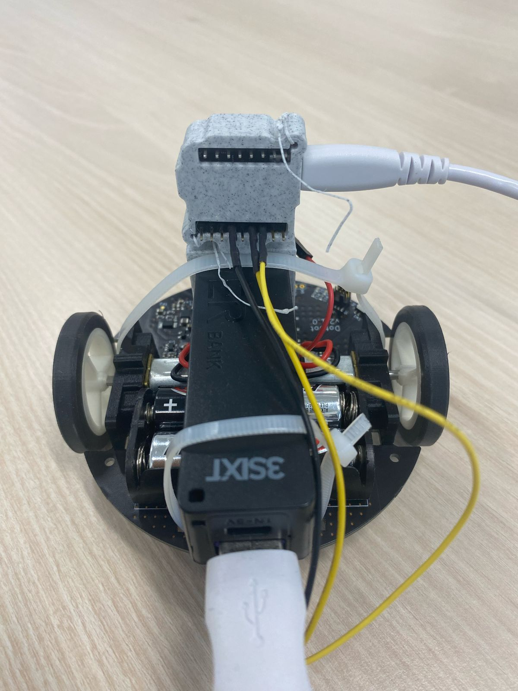
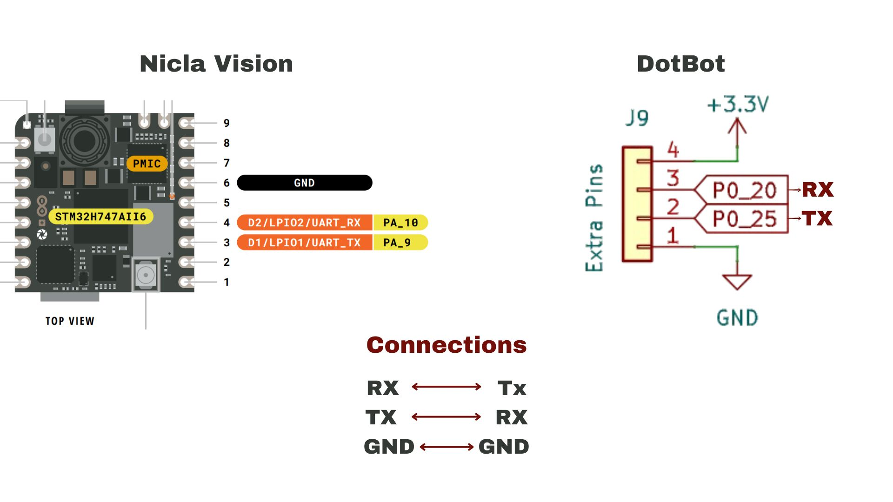
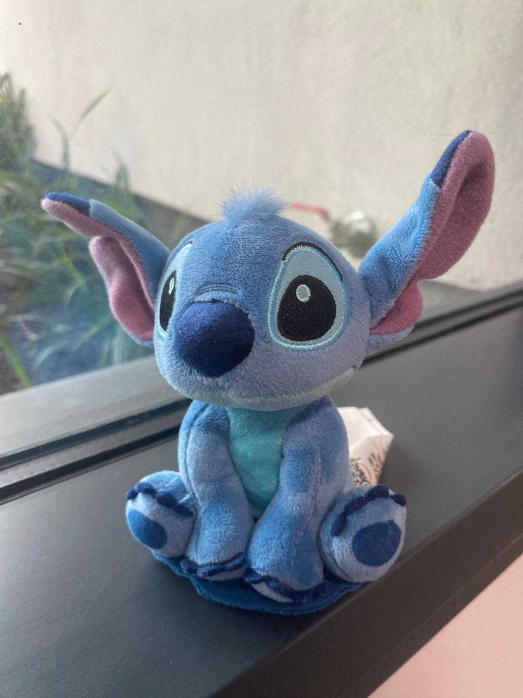

# DotBot-AI: Object Tracking Firmware for DotBot  

This repository contains the **SEGGER Embedded Studio project** for controlling DotBot using **object tracking with Nicla Vision**.  
The Nicla Vision detects objects and sends their **Y-coordinate** via UART. The DotBot firmware, written in **C**, processes this data to control the motors accordingly.

## Project Structure
- `Nicla_Vision/main.py`: MicroPython code for Nicla Vision.
- `Nicla_Vision/trained_stitch.tflite`: Trained AI model for detection.
- `Nicla_Vision/labels_stitch.txt`: Model labels.
- `DotBot_firmware_AI/DotBot_control_motors_AI.c`: C code for receiving data and controlling the motors.

## Functionality  
### **Nicla Vision (MicroPython)**
- Captures images and detects objects using **TinyML** (`trained_stitch.tflite`).  
- Sends **Y-coordinate** via **UART** (`bytearray` format).  
- `center_y` is used instead of `center_x` because the camera is rotated 90°.

### **DotBot Firmware (C)**
- Listens to UART data from Nicla Vision.  
- Determines whether the object is **above, below, or centered**.  
- Adjusts **motor speed and direction** accordingly.

## DotBot Setup
Here are two images showing how the **Nicla Vision** is mounted on the DotBot and a diagram showing the pins to be connected:

  
 
 

## Installation & Setup

### 1.- Connect the Arduino Nicla Vision to the computer via USB and upload the files `main.py`, `labels_stitch.txt`, and `trained_stitch.tflite`.
  
### 2.- Clone the Required Repositories
- Since this project depends on the **DotBot Firmware**, you need to clone it inside the same parent directory as this repository: 

```bash
git clone https://github.com/DotBots/DotBot-firmware
```

- Make sure DotBot-AI and DotBot-Firmware are in the same directory.

### 3.- Install **SEGGER Embedded Studio** (if not already installed).

### 4.- Upload the firmware to the DotBot.

- Open **SEGGER Embedded Studio**
- Connect the **nRF5340-DK** to the computer and then to the **DotBot**.
- Power on the **nRF5340-DK** and the **DotBot**.
- Go to Target -> Connect J-Link.
- To upload the firmware, double-click the **DotBot_firmware_AI** project (it should now appear in bold) and press `Ctrl+t` followed by `l` (lowercase L).

## Run the system

### 1.- Connect the Nicla Vision arduino to the battery, this will turn it on automatically. 
### 2.- Turn the Dotbot switch to `ON`. DotBot will automatically begin detecting and tracking the object.

## Object to Track  
By default, the system is trained to detect and follow a **Stitch plush toy**.

 

If you want to track a different object, you may need to retrain the AI model.

## Training a Custom Model  
If you want to detect a different object, you need to train a new **TinyML model**.  
Here are the steps using **Edge Impulse**:

1. **Collect Images**  
   - Capture images of the new object from different angles, backgrounds and lighting conditions.  

2. **Upload Data to Edge Impulse**  
   - Create a project on [Edge Impulse](https://www.edgeimpulse.com/).  
   - Upload the collected images.
   - Label the images according to the object class.

3. **Train the Model**  
   - Select **FOMO (Faster Objects, More Objects)** as the model type for efficient detection. (The RAM of the Arduino Nicla Vision is only 1MB, so you won't be able to use heavier models)
   - Train and optimize the model.

4. **Export the Model**  
   - Deploy the model in OpenMV library.
  
5. **Update Model and Labels**
   - Replace `trained_stitch.tflite` with the new model in the **Nicla Vision**.
   - You also need to edit `main.py` and replace all instances of `"trained_stitch.tflite"` with the name of your newly trained model.
   - Replace `labels_stitch.txt` with the new labels file downloaded from Edge Impulse in the **Nicla Vision**.
   - You also need to edit `main.py` and replace all instances of `"labels_stitch.txt"` with the name of your new labels file.

6. **Run the System**
   - Connect the Nicla Vision arduino to the battery, this will turn it on automatically. 
   - Turn the Dotbot switch to `ON`. DotBot will automatically begin detecting and tracking the object.
  
## Limitations of the Approach  
While this system works well for simple objects, it has some limitations:  

1. **Detection Accuracy**  
   - If the object has **complex textures, transparency, or varying shapes**, the model may struggle to detect it accurately.  
   - The model performs better with **distinctive and well-defined objects**.  

2. **Memory Constraints**  
   - The **Arduino Nicla Vision** has limited RAM (1MB).
   - If the model is too large, it **may not fit in memory**, causing errors or crashes.  
   - To avoid this, keep the model small or optimize it with **quantization** in Edge Impulse.  

3. **Lighting and Background Effects**  
   - Poor lighting or cluttered backgrounds may affect detection performance.  
   - The model should be trained with **diverse environmental conditions** for better robustness.
